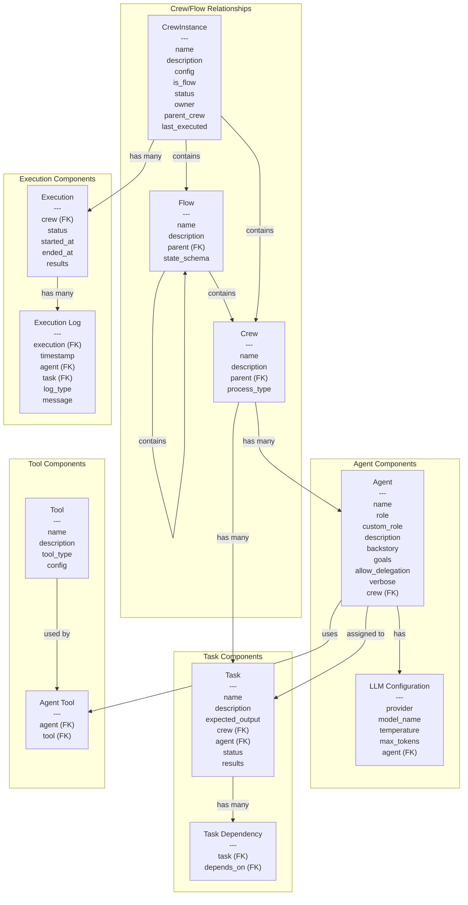

# Crew Flow Architecture

This diagram illustrates the relationship between CrewInstances, Crews, Flows, Agents, Tasks, and Tools in the system.


```

## 2. Implementation Approach

Here's the implementation approach document for `docs/crew/new_crew_flow.md`:

```markdown:docs/crew/new_crew_flow.md
# Crew Flow Implementation Approach

## Overview

This document outlines the approach for implementing a comprehensive Crew and Flow management system built on Django and integrating with CrewAI. The system allows for creating, managing, and executing AI workflows with multiple agents working together on complex tasks.

## Key Concepts

### CrewInstance

A CrewInstance serves as the top-level container in our architecture. It can contain one or more Crews and/or Flows. 

- A CrewInstance with `is_flow=False` represents a traditional CrewAI Crew
- A CrewInstance with `is_flow=True` represents a CrewAI Flow that can contain multiple Crews

### Crews and Flows

- **Crew**: A group of AI agents working together on tasks with a defined process (sequential, hierarchical)
- **Flow**: An orchestrator that connects multiple crews and/or other flows, manages state, and controls execution flow

### Agents

- AI entities with specific roles, goals, and capabilities
- Can use different LLM models and tools
- Assigned to specific tasks within a crew

### Tasks

- Units of work assigned to agents
- Can have dependencies on other tasks
- Store execution results

### Tools

- Capabilities that can be attached to agents
- Examples: web search, file reading/writing, code execution, etc.

## Data Model Refinements

Building on the existing architecture, we propose the following refinements:

### 1. CrewInstance Model Enhancements

```python
class CrewInstance(models.Model):
    name = models.CharField(max_length=255)
    description = models.TextField(blank=True)
    config = models.JSONField(default=dict)
    is_flow = models.BooleanField(default=False)
    status = models.CharField(max_length=50, choices=STATUS_CHOICES, default='idle')
    owner = models.ForeignKey(User, on_delete=models.CASCADE)
    parent_crew = models.ForeignKey('self', null=True, blank=True, on_delete=models.SET_NULL, related_name='child_crews')
    last_executed = models.DateTimeField(null=True, blank=True)
    
    # New fields
    process_type = models.CharField(max_length=50, choices=PROCESS_CHOICES, default='sequential')
    state_schema = models.JSONField(default=dict, help_text="Schema for structured state in flows")
    
    def get_crew_instance(self):
        """Convert this Django model to a CrewAI Crew or Flow instance"""
        if self.is_flow:
            return self._create_flow_instance()
        else:
            return self._create_crew_instance()
            
    def _create_crew_instance(self):
        """Create a CrewAI Crew instance from this model"""
        from crewai import Crew, Process
        
        agents = [agent.get_agent_instance() for agent in self.agent_set.all()]
        tasks = [task.get_task_instance() for task in self.task_set.all()]
        
        process = getattr(Process, self.process_type, Process.sequential)
        
        return Crew(
            agents=agents,
            tasks=tasks,
            process=process,
            verbose=True,
            **self.config
        )
        
    def _create_flow_instance(self):
        """Create a CrewAI Flow instance from this model"""
        # Implementation depends on how CrewAI flows are instantiated
        # Will need to gather all child crews and create a flow
        pass
```

### 2. Agent Model Refinements

```python
class Agent(models.Model):
    name = models.CharField(max_length=255)
    role = models.CharField(max_length=255)
    custom_role = models.TextField(blank=True)
    description = models.TextField(blank=True)
    backstory = models.TextField(blank=True)
    goals = models.JSONField(default=list)
    allow_delegation = models.BooleanField(default=False)
    verbose = models.BooleanField(default=True)
    crew = models.ForeignKey(CrewInstance, on_delete=models.CASCADE)
    
    # LLM Configuration
    llm_provider = models.CharField(max_length=100, choices=LLM_PROVIDER_CHOICES, default='openai')
    llm_model = models.CharField(max_length=100, default='gpt-4o')
    llm_temperature = models.FloatField(default=0.7)
    llm_max_tokens = models.IntegerField(null=True, blank=True)
    llm_config = models.JSONField(default=dict)
    
    def get_agent_instance(self):
        """Convert this Django model to a CrewAI Agent instance"""
        from crewai import Agent
        
        # Get all tools associated with this agent
        tools = [agent_tool.tool.get_tool_instance() for agent_tool in self.agenttool_set.all()]
        
        # Create the LLM configuration
        llm = {
            "provider": self.llm_provider,
            "model": self.llm_model,
            "temperature": self.llm_temperature,
        }
        if self.llm_max_tokens:
            llm["max_tokens"] = self.llm_max_tokens
        
        # Add any additional config
        llm.update(self.llm_config)
        
        return Agent(
            role=self.role if not self.custom_role else self.custom_role,
            goal=self.goals[0] if self.goals else "",
            backstory=self.backstory,
            verbose=self.verbose,
            allow_delegation=self.allow_delegation,
            tools=tools,
            llm=llm
        )
```

### 3. New Tool Model

```python
class Tool(models.Model):
    name = models.CharField(max_length=255)
    description = models.TextField(blank=True)
    tool_type = models.CharField(max_length=100, choices=TOOL_TYPE_CHOICES)
    config = models.JSONField(default=dict)
    
    def get_tool_instance(self):
        """Convert this Django model to a CrewAI Tool instance"""
        # Implementation depends on tool type
        if self.tool_type == 'serper_search':
            from crewai_tools import SerperDevTool
            return SerperDevTool()
        elif self.tool_type == 'file_read':
            from crewai_tools import FileReadTool
            return FileReadTool()
        # ... and so on for other tool types
```

### 4. AgentTool Relationship

```python
class AgentTool(models.Model):
    agent = models.ForeignKey(Agent, on_delete=models.CASCADE)
    tool = models.ForeignKey(Tool, on_delete=models.CASCADE)
    
    class Meta:
        unique_together = ('agent', 'tool')
```

## UI Implementation

Building on the existing UI components, we'll extend the interface to support the enhanced model:

### 1. CrewInstance Management

- List view showing all crews and flows (with visual distinction)
- Detail view showing:
  - Basic information
  - List of contained crews/flows (if a flow)
  - List of agents and tasks
  - Execution history
- Create/Edit forms with:
  - Option to specify as crew or flow
  - Process type selection
  - State schema editor (for flows)
  - Parent crew/flow selection

### 2. Agent Management

- Enhanced agent create/edit form with:
  - LLM model selection
  - Tool selection (multiple)
  - Goals input (multiple)
- Agent detail view showing:
  - Basic information
  - LLM configuration
  - Associated tools
  - Associated tasks

### 3. Flow Editor

- Visual editor for creating and connecting flows
- Ability to add crews to flows
- Ability to connect tasks between different crews
- State management configuration

## API Integration with CrewAI

The system will integrate with CrewAI through a well-defined API layer:

### 1. Crew Execution

```python
def execute_crew(crew_instance_id):
    crew_instance = CrewInstance.objects.get(id=crew_instance_id)
    
    # Create a new execution record
    execution = Execution.objects.create(
        crew=crew_instance,
        status='running',
        started_at=timezone.now()
    )
    
    try:
        # Get the CrewAI instance
        crew_ai_instance = crew_instance.get_crew_instance()
        
        # Execute the crew
        result = crew_ai_instance.kickoff()
        
        # Update execution with results
        execution.status = 'completed'
        execution.ended_at = timezone.now()
        execution.results = {'output': result}
        execution.save()
        
        # Update tasks with results
        # Implementation depends on how CrewAI returns results
        
        return result
    except Exception as e:
        # Handle errors
        execution.status = 'failed'
        execution.ended_at = timezone.now()
        execution.results = {'error': str(e)}
        execution.save()
        
        raise
```

### 2. Flow Execution

Flow execution will be more complex, as it needs to manage state and the execution of multiple crews.

```python
def execute_flow(crew_instance_id, initial_state=None):
    flow_instance = CrewInstance.objects.get(id=crew_instance_id)
    
    if not flow_instance.is_flow:
        raise ValueError("This instance is not a flow")
    
    # Create a new execution record
    execution = Execution.objects.create(
        crew=flow_instance,
        status='running',
        started_at=timezone.now()
    )
    
    try:
        # Get the CrewAI Flow instance
        flow_ai_instance = flow_instance.get_crew_instance()
        
        # Execute the flow
        result = flow_ai_instance.kickoff(state=initial_state or {})
        
        # Update execution with results
        execution.status = 'completed'
        execution.ended_at = timezone.now()
        execution.results = {'output': result}
        execution.save()
        
        return result
    except Exception as e:
        # Handle errors
        execution.status = 'failed'
        execution.ended_at = timezone.now()
        execution.results = {'error': str(e)}
        execution.save()
        
        raise
```

## Django Integration

The system will leverage Django's powerful ORM and class-based views:

### 1. CrewInstance Views

```python
class CrewInstanceListView(LoginRequiredMixin, ListView):
    model = CrewInstance
    template_name = 'crew/crew_list.html'
    context_object_name = 'crews'
    
    def get_queryset(self):
        return CrewInstance.objects.filter(owner=self.request.user)
        
    def get_context_data(self, **kwargs):
        context = super().get_context_data(**kwargs)
        context['crews'] = context['crews'].filter(is_flow=False)
        context['flows'] = CrewInstance.objects.filter(
            owner=self.request.user, 
            is_flow=True
        )
        return context
```

### 2. Flow Views

```python
class FlowCreateView(LoginRequiredMixin, CreateView):
    model = CrewInstance
    template_name = 'crew/flow_form.html'
    form_class = FlowForm
    success_url = reverse_lazy('crew:flow_list')
    
    def form_valid(self, form):
        form.instance.is_flow = True
        form.instance.owner = self.request.user
        return super().form_valid(form)
```

### 3. Flow Execution Views

```python
class ExecuteFlowView(LoginRequiredMixin, View):
    def get(self, request, pk):
        flow = get_object_or_404(CrewInstance, pk=pk, owner=request.user, is_flow=True)
        # Show confirmation page
        return render(request, 'crew/execute_flow.html', {'flow': flow})
        
    def post(self, request, pk):
        flow = get_object_or_404(CrewInstance, pk=pk, owner=request.user, is_flow=True)
        
        # Get initial state from form if provided
        initial_state = {}
        if request.POST.get('initial_state'):
            try:
                initial_state = json.loads(request.POST.get('initial_state'))
            except json.JSONDecodeError:
                messages.error(request, "Invalid JSON for initial state")
                return redirect('crew:flow_detail', pk=pk)
        
        # Execute flow in background task
        execute_flow.delay(flow.id, initial_state)
        
        messages.success(request, f"Flow '{flow.name}' execution started")
        return redirect('crew:flow_detail', pk=pk)
```

## Implementation Considerations

### 1. Scalability

- Use Celery for background task processing
- Implement proper database indexing
- Consider caching for frequently accessed data

### 2. User Experience

- Provide real-time updates during execution using WebSockets
- Implement a visual flow editor using a JavaScript library
- Add detailed logging and progress indicators

### 3. Error Handling

- Implement comprehensive error handling
- Provide detailed error messages and suggestions
- Allow for retrying failed executions

### 4. Security

- Ensure proper access control
- Validate all user inputs
- Sanitize outputs to prevent XSS

## Migration Strategy

Since the current implementation already has some of these concepts, we can implement this incrementally:

1. Update the data models with the new fields and relationships
2. Create migrations for these changes
3. Implement the Python classes for CrewAI integration
4. Update the UI to support the new features
5. Add the flow execution functionality
6. Implement the visual flow editor

## Conclusion

This implementation approach builds on the existing architecture while extending it to support the more complex relationships between crews, flows, agents, tasks, and tools. It maintains compatibility with the CrewAI framework while providing a user-friendly interface for creating and managing AI workflows.

The Django-based implementation leverages the framework's strengths in data modeling, form handling, and view management, while the integration with CrewAI allows for powerful AI agent collaboration.
```

## Summary of the Approach

I've designed the new architecture to incorporate the CrewAI concepts of Crews and Flows while building on your existing Django implementation. Key points:

1. **Enhanced Data Model**:
   - CrewInstance can be either a Crew or a Flow (via the `is_flow` flag)
   - Crews can contain Agents and Tasks
   - Flows can contain multiple Crews and other Flows
   - Agents can have specific LLM configurations and Tools

2. **UI Enhancements**:
   - Separate views for Crews vs Flows
   - Visual editor for creating and connecting flows
   - Tool management interface

3. **CrewAI Integration**:
   - Methods to convert Django models to CrewAI objects
   - Execution handlers for both Crews and Flows
   - Background task processing for long-running executions
